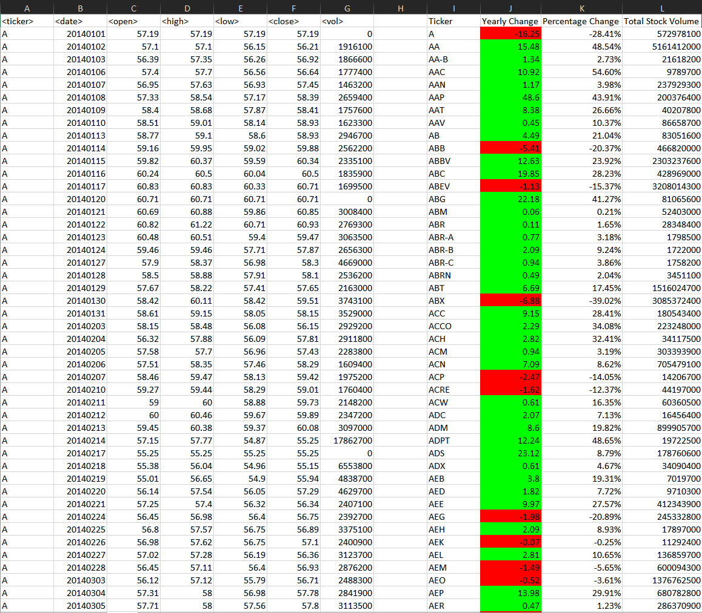
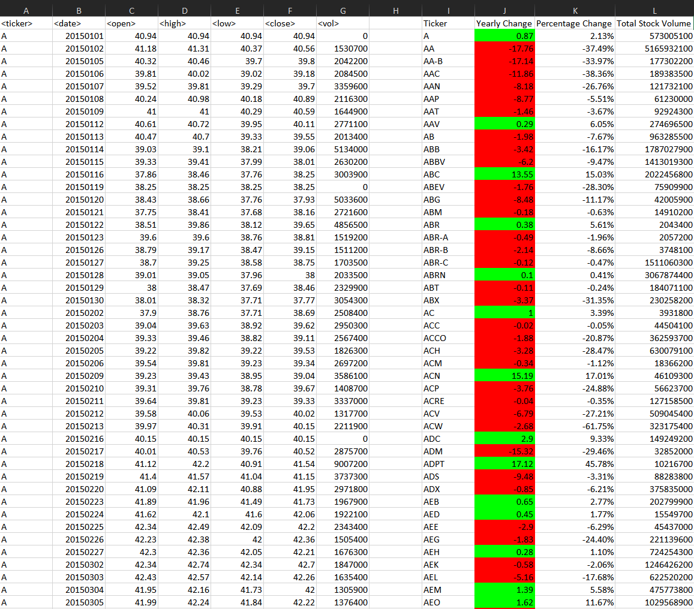
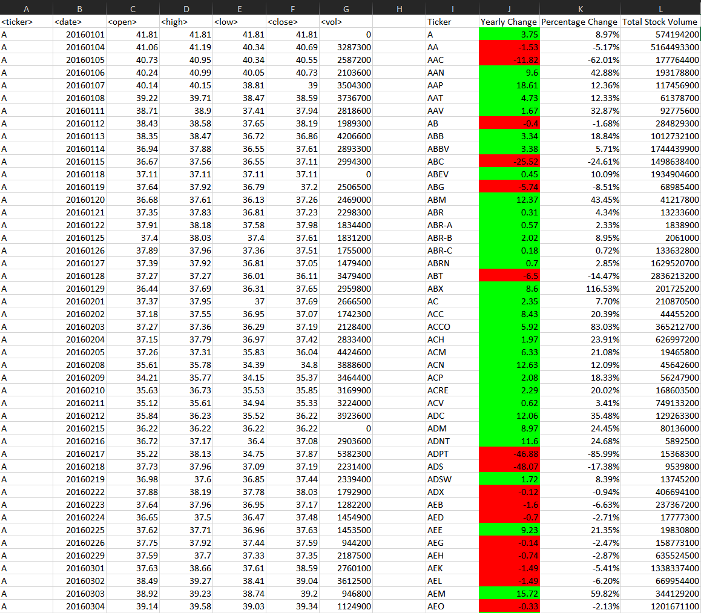

# The VBA Of Wall Street

### Stock Market Analysis

---

Using the test data provided here: https://bit.ly/3m9WqoO

A VBA Script was created that will loop through all the stocks for one year and output the following information:
- Ticker Symbol
- Yearly change from opening price at the beginning of a given year to the closing price at the end of that year.
- The percent change from opening price at the beginning of a given year to the closing price at the end of that year.
- The total stock volume of the stock.

**Conditional Formatting is used to highlight postitive change in green and negative change in red.**

The final report was then generated using this data: https://bit.ly/3xU53Gc

# Final Report Screen Shots
----
## 2014 Analysis
---

## 2015 Analysis
---

## 2016 Analysis
---

